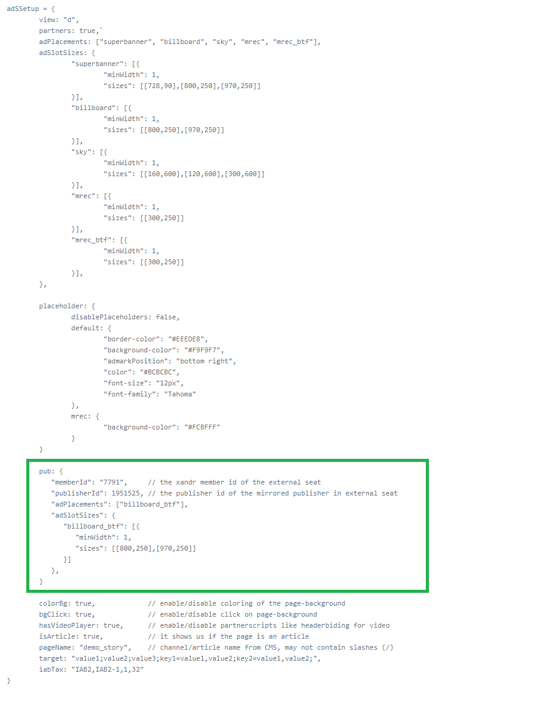

# Multiseat Advertising Documentation


## Use Case

These specs describe how to enable the use of two Xandr Seats (Media Impact and Welt) on a single publisher. This allows exclusive Advertisings to be set for publisher collaborations and deals.

## Technical Setup

### Changes in adSSetup

To enable the feature, you have to include the following object in your adSSetup to that the adlib knows which Xandr seat and publisher to connect with. The object will contain (like the adSSetup in general) an “adPlacements”- and “adSlotSizes”-object. These multiseat slots and sizes will be delivered as ordered here.


```
/* include the ‘pub’ object directly into the adSSetup */
pub: {
   "memberId": "7791", // the xandr member id of the external seat
   "publisherId": 1951525, // the publisher id of the mirrored publisher in external seat
   "adPlacements": ["billboard_btf"], 
   "adSlotSizes": {
      "billboard_btf": [{
         "minWidth": 1,
         "sizes": [[800,250],[970,250]]
      }]
   },
}
```


### AdSlot Changes

Very like the normal ad integration you will need an adslot container where the ad will be rendered in. The prefix `“pub_”` on the adslot will indicate the adlib, that this is the slot defined in the adSSetup.pub and will be handled in the intended way. 

```
<div id="pub_billboardWrapper">
   <div id="pub_billboard_btf">

   </div>
</div>
```

```diff
- Please make sure that the adslot will not be styled or get any css classes from your site, 
- since this could break either the creative or/and the template behaviour! 
```

```diff
! If you need to style the container (for example with paddings / borders etc.) 
! use a wrapper around the slot and set classes on this instead.
```


### Sample for adSSetup Syntax




## Help

If you have some question don't hesitate to contact us:

__Ad Technology Team__
  adtechnology@axelspringer.de


